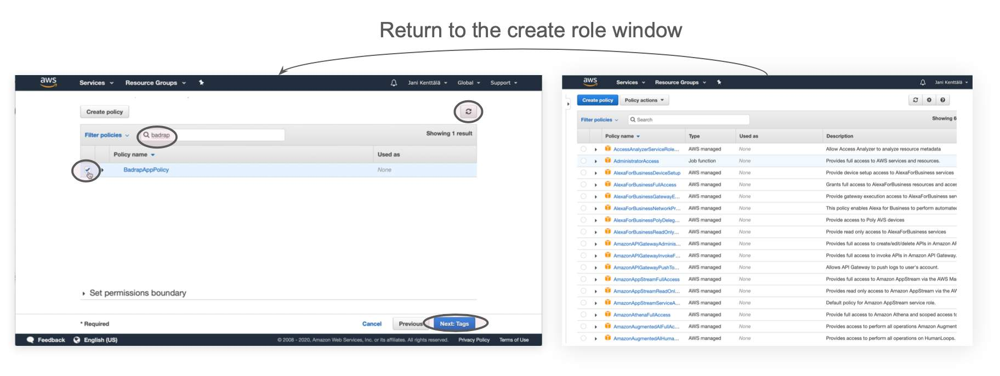

# Amazon Web Services (AWS)

## Overview

Connect to Amazon Web Services to automatically bring your cloud assets into Badrap for monitoring.

## Install the App

1. Open the [AWS app page](https://badrap.io/apps/aws).
1. Install the app.
1. Take note of the External ID value that the app has generated for you. You'll need this later.


## Create Required AWS Role & Policy

Setting up the Badrap app with Amazon Web Services requires configuring role delegation using AWS IAM.

1. Create a new role in the [AWS IAM console.](https://console.aws.amazon.com/iam/home#/roles)
2. Select `Another AWS account` for the role type.
3. Enter `808384617942` (Badrap's Account ID) as the `Account ID`.


4. Check the `Require external ID` option, and enter the External ID that the app generated for you earlier as the `External ID`.
5. Leave the `Require MFA` option unchecked.
6. Click `Next: Permissions`.


7. If you've already created a policy, skip the following substeps. Otherwise click `Create Policy`, which opens a new window.


   1. Select the `JSON` tab and enter the following policy snippet into the text box:

   ```json
   {
     "Version": "2012-10-17",
     "Statement": [
       {
         "Sid": "VisualEditor0",
         "Effect": "Allow",
         "Action": [
           "ec2:DescribeInstances",
           "lightsail:GetInstances",
           "ec2:DescribeRegions",
           "lightsail:GetRegions"
         ],
         "Resource": "*"
       }
     ]
   }
   ```
   
   2. Click `Review policy`.
   3. Name the policy (e.g., `BadrapAppPolicy`).
   4. Click `Create policy`
   5. Return to the `Create role` window.
   6. Refresh the list of policies
8. Select the BadrapAppPolicy


9. Click `Next: Tags`.
10. Click `Next: Review`.
11. Name the role (e.g., `BadrapAppRole`).
12. Click `Create role`.

## Finish the Installation

1. Return to the [AWS app page](https://badrap.io/apps/aws).
1. Enter your [AWS Account ID](https://console.aws.amazon.com/billing/home?#/account) into the `Account ID` field.
1. Enter the name of the AWS role you created earlier. **Note that the role name is case sensitive!**
1. Click `Add`.
