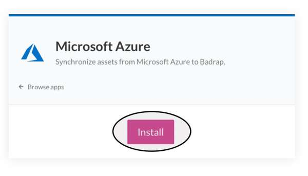
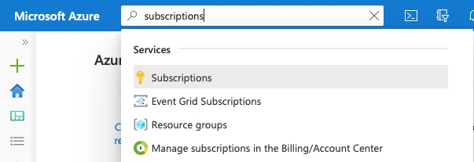
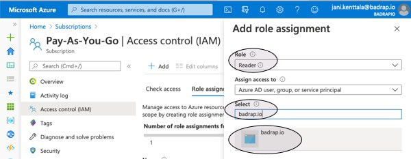

# Microsoft Azure

This app allows you to synchronize your Azure assets into Badrap and receive security notifications about them. The app needs to be installed and enabled under your Badrap user account to get started. The app fetches a list of your organization's public IP-addresses from your Azure installation with your consent, and adds those assets under your Badrap user account. If you do not have administrator rights for your organization's Office 365 installation, you will need help from your administrator to set up the app.

## Install the App in Badrap

You'll need Global Administrator, Application Administrator, Cloud Application Administrator privileges to perform this action. If you don't have these roles, your administrator can grant you AzureWatcher -role. Your Azure administrator can follow the process desribed in detail in [O365 app documentation](o365.html#instructions-for-office-365-administrators-to-allow-a-user-to-install-badrap-office-365-app). Just make sure the administrator will give you AzureWatcher role, instead of Office 365 watcher.

1. Open the [Azure app page](https://badrap.io/apps/azure)

2. App asks for your consent to create & manage new assets. Click Install the app -button.

3. Click Add new account
4. Log in with your account

Badrap app is now installed. Next, give it (the minimal) access in Azure portal.

## Assign a reader role for badrap.io in Azure portal

This phase has to happen *after* you (or someone in your organisation) has installed Azure app in Badrap.

1. Log in to your Azure portal: <https://portal.azure.com/>

2. Select one or more subscription you want to monitor

3. Go to Access control (IAM) and click Add

4. Select Add role assignment. 
5. In "Add role assignment" area, select "Reader" role. Under "Select", type badrap.io and click the badrap.io object which will appear. Press save.

6. badrap.io should now be visible under section "Reader"

7. You are now ready. Your subscription's public IP-addresses should appear in your Badrap [asset list](https://badrap.io/assets) in few minutes.

