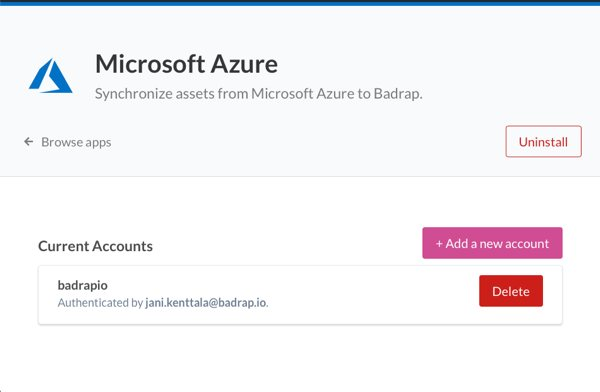
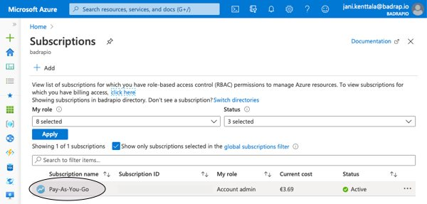
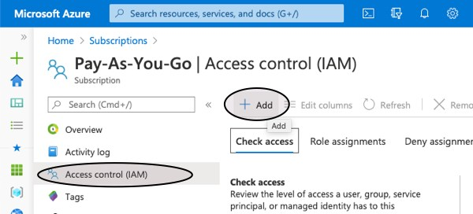
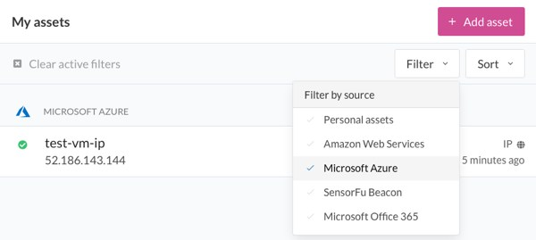

# Microsoft Azure

Synchronize assets from Microsoft Azure to Badrap.

## Install the App in Badrap

1. Open the [Azure app page](https://badrap.io/apps/azure)

2. App asks for your consent to create & manage new assets. Click Install the app -button.

3. Click Add new account
4. Log in with your account

Badrap app is now installed. Next, give it (the minimal) access in Azure portal.

## Assign a reader role for badrap.io in Azure portal

This phase has to happen *after* you (or someone in your organisation) has installed Azure app in Badrap.

1. Log in to your Azure portal: <https://portal.azure.com/>

2. Select one or more subscription you want to monitor

3. Go to Access control (IAM) and click Add

4. Select Add role assignment. 
5. In "Add role assignment" area, select "Reader" role. Under "Select", type badrap.io and click the badrap.io object which will appear. Press save.

6. badrap.io should now be visible under section "Reader"

7. You are now ready. Your subscription's public IP-addresses should appear in your Badrap [asset list](https://badrap.io/assets) in few minutes.

